# VBT Staj Projesi — Frontend (React + Vite)

## Proje Hakkında

Bu proje, VBT stajı kapsamında geliştirilen JWT tabanlı kimlik doğrulama sisteminin **React frontend**'idir. Kullanıcılar giriş yapabilir, kayıt olabilir ve dashboard sayfasına erişebilir. Backend API (Spring Boot, port 8080) ile iletişim kurar.

> **Not:** Projede iki ayrı frontend bulunmaktadır:
> - `frontend/` — İlk geliştirilen Vanilla HTML/JS versiyonu (Tailwind CDN + SweetAlert2)
> - `react-frontend/` — React ile yeniden yazılmış modern versiyon **(ana frontend)**

Bu README, **React frontend** (`react-frontend/`) için hazırlanmıştır. Vanilla frontend hakkında bilgi de aşağıda yer almaktadır.

---

## Kullanılan Teknolojiler

| Teknoloji | Versiyon | Açıklama |
|---|---|---|
| **React** | 19.2.7 | UI kütüphanesi |
| **Vite** | 8.1.1 | Build aracı ve geliştirme sunucusu |
| **React Router DOM** | 7.18.1 | Sayfa yönlendirme (client-side routing) |
| **Axios** | 1.18.1 | HTTP istemcisi (interceptor desteğiyle) |
| **React Hook Form** | 7.82.0 | Form yönetimi |
| **Zod** | 4.4.3 | Form validasyon şemaları |
| **@hookform/resolvers** | 5.4.0 | Zod + React Hook Form entegrasyonu |
| **Tailwind CSS** | 4.3.3 | Utility-first CSS framework |
| **PostCSS** | 8.5.19 | CSS post-işlemci |
| **Autoprefixer** | 10.5.4 | Otomatik tarayıcı prefix ekleme |
| **Playwright** | 1.61.1 | End-to-End (E2E) test framework'ü |
| **ESLint** | 10.6.0 | Kod kalite kontrolü |

## Proje Yapısı

```
react-frontend/
├── public/                        # Statik dosyalar
├── src/
│   ├── main.jsx                   # Uygulama giriş noktası (React root render)
│   ├── App.jsx                    # Route tanımları (BrowserRouter)
│   ├── App.css                    # Genel stiller
│   ├── index.css                  # Tailwind import
│   ├── api.js                     # Axios instance + interceptor'lar
│   ├── assets/
│   │   ├── hero.png               # Görsel
│   │   ├── react.svg              # React logosu
│   │   └── vite.svg               # Vite logosu
│   └── components/
│       ├── LoginForm.jsx          # Giriş sayfası bileşeni
│       ├── RegisterForm.jsx       # Kayıt sayfası bileşeni
│       └── Dashboard.jsx          # Dashboard sayfası bileşeni
├── tests/
│   └── example.spec.js            # Playwright E2E test
├── index.html                     # HTML şablonu
├── package.json                   # Bağımlılıklar ve scriptler
├── vite.config.js                 # Vite yapılandırması
├── tailwind.config.js             # Tailwind CSS yapılandırması
├── postcss.config.js              # PostCSS yapılandırması
├── eslint.config.js               # ESLint yapılandırması
└── playwright.config.js           # Playwright test yapılandırması
```

## Sayfalar ve Route'lar

| Route | Bileşen | Açıklama |
|---|---|---|
| `/` | — | Otomatik olarak `/login`'e yönlendirir |
| `/login` | `LoginForm.jsx` | Kullanıcı giriş sayfası |
| `/register` | `RegisterForm.jsx` | Kullanıcı kayıt sayfası |
| `/dashboard` | `Dashboard.jsx` | Giriş sonrası karşılama sayfası |

## Özellikler

### Giriş Sayfası (`LoginForm.jsx`)
- Email ve şifre ile giriş
- Zod ile client-side form validasyonu (email formatı, şifre min 6 karakter)
- Şifre göster/gizle toggle
- Başarılı girişte access token localStorage'a kaydedilir ve Dashboard'a yönlendirilir
- Hata durumlarında kullanıcıya mesaj gösterilir (sunucu kapalı, hatalı bilgi vb.)
- **429 Rate Limit** koruması: Çok fazla hatalı giriş denemesinde buton 60 saniye devre dışı kalır ve geri sayım gösterilir

### Kayıt Sayfası (`RegisterForm.jsx`)
- Ad, soyad, email ve şifre alanları
- Zod ile validasyon (ad/soyad min 2 karakter, email formatı, şifre min 6 karakter)
- Şifre göster/gizle toggle
- Başarılı kayıtta bilgi mesajı gösterilir
- Email kullanımdaysa hata mesajı gösterilir

### Dashboard Sayfası (`Dashboard.jsx`)
- Giriş yapmış kullanıcının adı ve soyadı API'den çekilir (`/users/me`)
- "Hoş geldiniz [AD SOYAD]!" mesajı gösterilir
- Çıkış yap butonu: localStorage'dan token silinir ve login sayfasına yönlendirilir
- Veri yüklenirken "Yükleniyor..." animasyonu gösterilir

### API Katmanı (`api.js`)
- Axios instance oluşturulur (`baseURL: http://localhost:8080`, `withCredentials: true`)
- **Request Interceptor:** Her istekte localStorage'daki access token otomatik olarak `Authorization` header'ına eklenir
- **Response Interceptor:** 401 hatası alındığında otomatik olarak `/auth/refresh` endpoint'ine istek atılır, yeni token alınır ve orijinal istek tekrarlanır. Refresh da başarısız olursa kullanıcı login sayfasına yönlendirilir.

## Port

| Servis | Port | Açıklama |
|---|---|---|
| **Vite Dev Server** | `5173` (veya `5174`) | React geliştirme sunucusu |

> Backend API'nin `http://localhost:8080` adresinde çalışıyor olması gerekir.

## Kurulum ve Çalıştırma

### 1. Ön Gereksinimler

- Node.js (v18 veya üzeri önerilir)
- npm

### 2. Bağımlılıkları Yükleme

```bash
cd react-frontend
npm install
```

### 3. Geliştirme Sunucusunu Başlatma

```bash
npm run dev
```

Tarayıcıda açın: `http://localhost:5173`

### 4. Üretim Build'i

```bash
npm run build
```

Build çıktısı `dist/` klasörüne oluşturulur.

### 5. Build Önizleme

```bash
npm run preview
```

### 6. E2E Testleri Çalıştırma

```bash
npx playwright test
```

## Backend ile İletişim

Frontend, aşağıdaki backend endpoint'lerini kullanır:

| Kullanıldığı Yer | HTTP Metodu | Endpoint | Açıklama |
|---|---|---|---|
| LoginForm | `POST` | `/auth/login` | Kullanıcı girişi, access token alır |
| RegisterForm | `POST` | `/auth/register` | Yeni kullanıcı kaydı |
| api.js (interceptor) | `POST` | `/auth/refresh` | Token yenileme (cookie ile) |
| Dashboard | `GET` | `/users/me` | Kullanıcı bilgilerini çeker |

## Test Kapsamı

### E2E Test (Playwright)
- **Başarılı giriş senaryosu:** Login sayfasına gider, geçerli email/şifre girer, butona tıklar, "Giriş başarılı" mesajını doğrular.

---

## Vanilla Frontend (`frontend/`) — Ek Bilgi

İlk geliştirme aşamasında oluşturulan, React öncesi basit HTML/JS versiyonudur.

### Kullanılan Teknolojiler
- HTML5
- Vanilla JavaScript (ES6+)
- Tailwind CSS (CDN)
- Font Awesome (ikonlar)
- SweetAlert2 (bildirim popup'ları)

### Dosya Yapısı
```
frontend/
├── index.html        # Giriş sayfası
├── register.html     # Kayıt sayfası
├── dashboard.html    # Dashboard sayfası
└── main.js           # Tüm JavaScript mantığı (authFetch, login, register, logout)
```

### Özellikler
- Giriş, kayıt ve çıkış işlevleri
- Access token memory'de (JavaScript değişkeninde) saklanır
- Refresh token yenileme (`authFetch` ile otomatik 401 yakalama)
- Şifre göster/gizle toggle
- SweetAlert2 ile şık bildirimler

## Yapay Zeka Entegrasyonu (AI Agents & Skills)

Projenin geliştirme sürecini hızlandırmak, tekrarlayan (boilerplate) işleri otomatize etmek ve kod standartlarını korumak amacıyla sisteme yapay zeka asistan kuralları (AI Skills/Agents) entegre edilmiştir.

* **Frontend Kuralı (`.claude/skills/component.md`):** Proje dizininde oluşturulan bu kural dosyası sayesinde, yapay zekaya `/component` komutu verildiğinde projeye özel standartlarda (Tailwind CSS, Zod validasyonları, React Hook Form ve Axios mimarisine uygun) yeni React bileşenleri üretmesi sağlanmıştır.
* Bu entegrasyon sayesinde arayüz geliştirme süreçlerindeki angarya iş yükü minimize edilmiş ve proje teslim süresi verimli kullanılmıştır.
  
  <br>
  
# VBT Staj Projesi — Backend (Spring Boot)

## Proje Hakkında

Bu proje, VBT stajı kapsamında geliştirilen **JWT tabanlı kimlik doğrulama (authentication) API**'sidir. Kullanıcı kayıt, giriş, token yenileme ve çıkış işlemlerini güvenli bir şekilde yönetir. Access Token + Refresh Token (HttpOnly Cookie) mimarisi kullanılmıştır.

## Kullanılan Teknolojiler

| Teknoloji | Versiyon | Açıklama |
|---|---|---|
| **Java** | 21 | Programlama dili |
| **Spring Boot** | 4.1.0 | Ana framework |
| **Spring Security** | — | Kimlik doğrulama ve yetkilendirme |
| **Spring Data JPA** | — | Veritabanı erişim katmanı (ORM) |
| **Spring Data Redis** | — | Redis ile token ve rate limit yönetimi |
| **PostgreSQL** | 17 (Alpine) | İlişkisel veritabanı |
| **Redis** | 7 (Alpine) | Refresh token saklama ve rate limiting |
| **JWT (jjwt)** | 0.12.6 | Access ve refresh token üretimi/doğrulama |
| **Argon2** (BouncyCastle) | 1.80 | Şifre hashleme algoritması |
| **Lombok** | — | Boilerplate kod azaltma |
| **SpringDoc OpenAPI** | 2.8.6 | Swagger API dokümantasyonu |
| **Spring Boot Actuator** | — | Uygulama metrik ve sağlık kontrolü |
| **Micrometer + Prometheus** | — | Metrik toplama ve dışa aktarma |
| **Grafana** | 12.1.0 | Metrik görselleştirme dashboard'u |
| **Docker Compose** | — | Altyapı servisleri orkestrasyonu |
| **k6** | — | Yük testi (load testing) |
| **H2 Database** | — | Test ortamı için in-memory veritabanı |
| **JUnit 5 + Mockito + AssertJ** | — | Unit ve integration test |
| **Maven** | — | Proje yönetimi ve bağımlılık çözümü |

## Proje Mimarisi

```
backend/
├── src/main/java/com/vbt/vbt_staj_loginproject/
│   ├── VbtStajLoginProjectApplication.java   # Ana başlatıcı sınıf
│   ├── config/
│   │   ├── SecurityConfig.java               # Spring Security yapılandırması
│   │   └── SwaggerConfig.java                # OpenAPI/Swagger yapılandırması
│   ├── controller/
│   │   ├── AuthController.java               # Kayıt, giriş, refresh, logout endpoint'leri
│   │   └── UserController.java               # Kullanıcı bilgileri endpoint'i (/users/me)
│   ├── dto/
│   │   ├── request/
│   │   │   ├── LoginRequestDto.java          # Giriş isteği (email, password)
│   │   │   └── RegisterRequestDto.java       # Kayıt isteği (firstName, lastName, email, password)
│   │   └── response/
│   │       ├── LoginResponseDto.java         # Giriş yanıtı (id, ad, soyad, email, accessToken)
│   │       ├── RegisterResponseDto.java      # Kayıt yanıtı (id, ad, soyad, email, accessToken, createdAt)
│   │       ├── RefreshResponseDto.java       # Refresh yanıtı (accessToken)
│   │       └── UserResponseDto.java          # Kullanıcı bilgisi yanıtı (id, email, ad, soyad)
│   ├── entity/
│   │   ├── BaseEntity.java                   # Ortak alanlar (id, createdAt, updatedAt)
│   │   └── User.java                         # Kullanıcı entity'si
│   ├── exception/
│   │   ├── EmailAlreadyExistException.java   # Email çakışması hatası (409)
│   │   ├── InvalidRefreshTokenException.java # Geçersiz refresh token hatası (401)
│   │   ├── ErrorResponse.java                # Standart hata yanıt formatı
│   │   └── GlobalExceptionHandler.java       # Merkezi hata yönetimi
│   ├── repository/
│   │   └── UserRepository.java               # JPA veritabanı erişim katmanı
│   ├── security/
│   │   ├── JwtService.java                   # Token üretme, doğrulama, çözme
│   │   ├── JwtFilter.java                    # Her istekte token doğrulama filtresi
│   │   ├── RateLimitFilter.java              # IP bazlı rate limiting filtresi
│   │   ├── CustomUserDetailService.java      # Email ile kullanıcı yükleme
│   │   └── UserPrincipal.java                # Spring Security kullanıcı temsili
│   └── service/
│       ├── AuthService.java                  # Kayıt, giriş, refresh, logout iş mantığı
│       ├── RefreshTokenService.java          # Redis'te refresh token CRUD işlemleri
│       └── RateLimitService.java             # Redis ile IP bazlı istek sayacı
├── src/main/resources/
│   └── application.yml                       # Uygulama yapılandırması
├── src/test/
│   ├── java/com/vbt/vbt_staj_loginproject/
│   │   ├── AuthIntegrationTest.java          # Uçtan uca entegrasyon testleri (10 senaryo)
│   │   ├── security/
│   │   │   └── JwtServiceTest.java           # JWT üretme/doğrulama unit testleri
│   │   └── service/
│   │       ├── AuthServiceTest.java          # AuthService unit testleri (Mockito)
│   │       └── RefreshTokenServiceTest.java  # Redis işlemleri unit testleri
│   └── resources/
│       └── application-test.yml              # Test ortamı yapılandırması (H2 + embedded Redis)
├── docker-compose.yml                        # PostgreSQL, Redis, Prometheus, Grafana
├── prometheus.yml                            # Prometheus scrape yapılandırması
├── load-test.js                              # k6 yük testi senaryosu
└── pom.xml                                   # Maven bağımlılıkları
```

## API Endpoint'leri

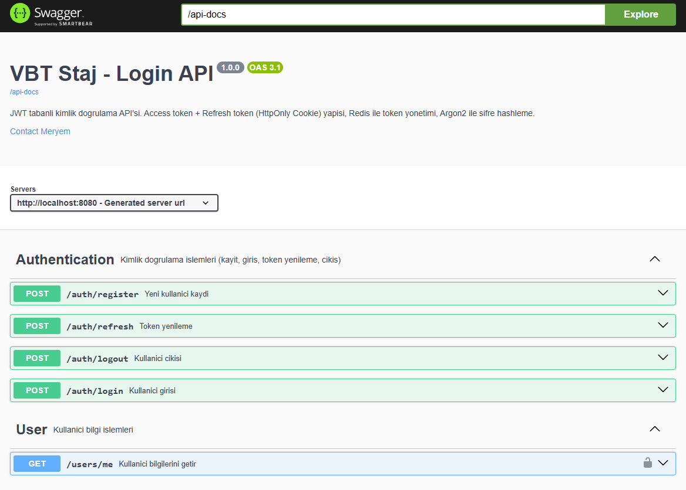

### Authentication (`/auth`)

| HTTP Metodu | Endpoint | Açıklama | İstek Gövdesi | Başarılı Yanıt |
|---|---|---|---|---|
| `POST` | `/auth/register` | Yeni kullanıcı kaydı | `{ firstName, lastName, email, password }` | `201` — id, ad, soyad, email, accessToken, createdAt |
| `POST` | `/auth/login` | Kullanıcı girişi | `{ email, password }` | `200` — id, ad, soyad, email, accessToken |
| `POST` | `/auth/refresh` | Token yenileme (Cookie'den) | — (Cookie otomatik gönderilir) | `200` — accessToken |
| `POST` | `/auth/logout` | Kullanıcı çıkışı | — (Cookie otomatik gönderilir) | `200` — Boş yanıt |

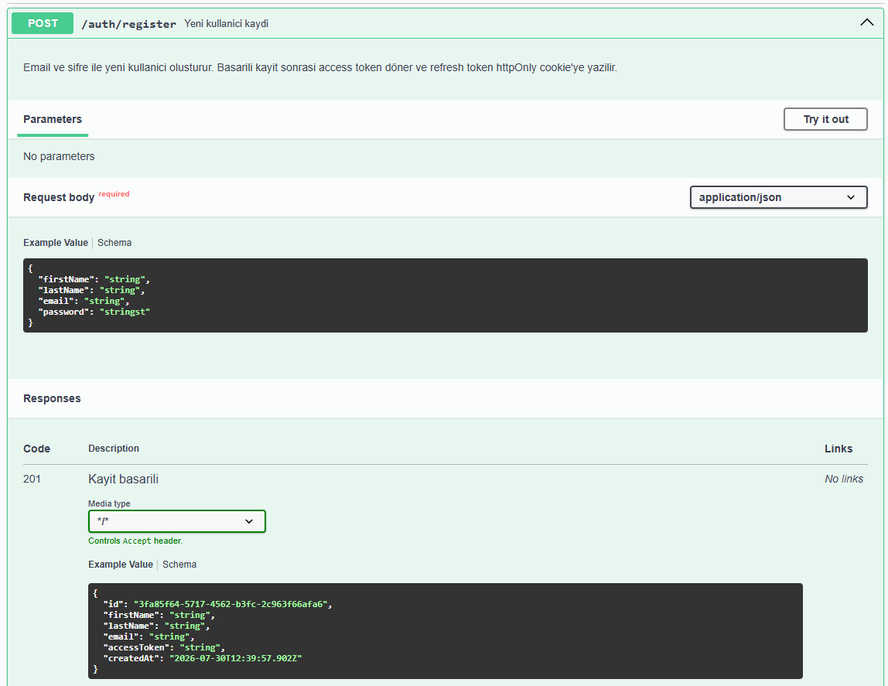

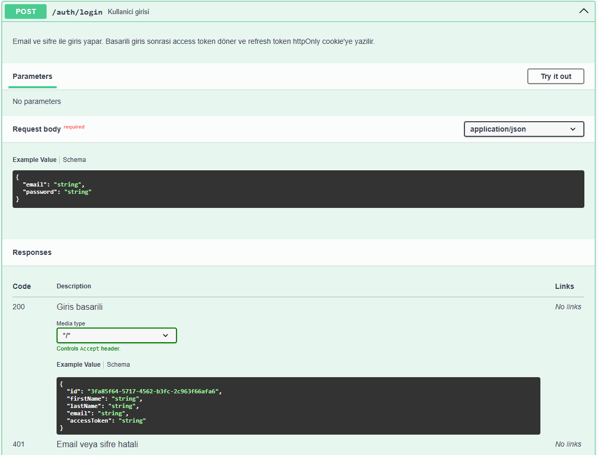

### User (`/users`) — *Yetkilendirme gerektirir (Bearer Token)*

| HTTP Metodu | Endpoint | Açıklama | Başarılı Yanıt |
|---|---|---|---|
| `GET` | `/users/me` | Giriş yapan kullanıcının bilgileri | `200` — id, email, firstName, lastName |

### Monitoring & Dokümantasyon

| Endpoint | Açıklama |
|---|---|
| `/swagger-ui.html` | Swagger API dokümantasyonu arayüzü |
| `/api-docs` | OpenAPI 3.0 JSON şeması |
| `/actuator/health` | Uygulama sağlık durumu |
| `/actuator/prometheus` | Prometheus metrikleri |
| `/actuator/metrics` | Spring Boot metrikleri |

### Örnek API Yanıtları

**Başarılı Kayıt (201 Created):**

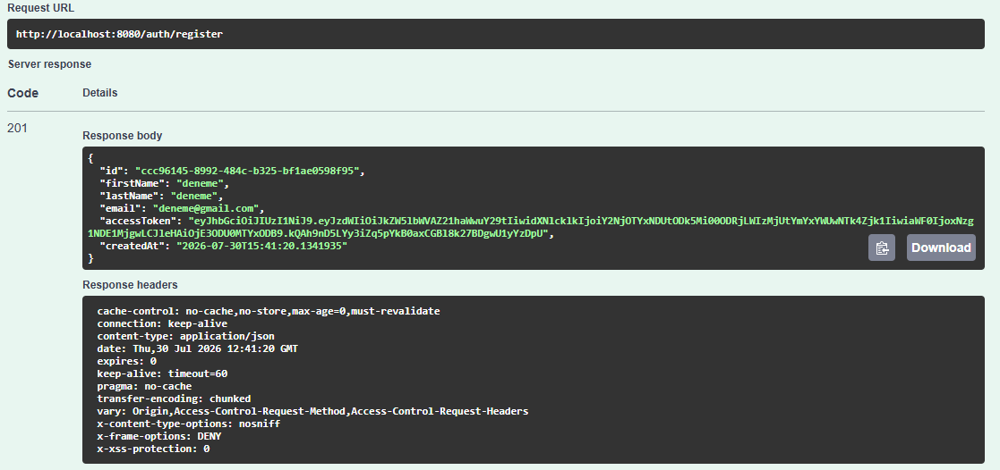

**Başarılı Giriş (200 OK):**

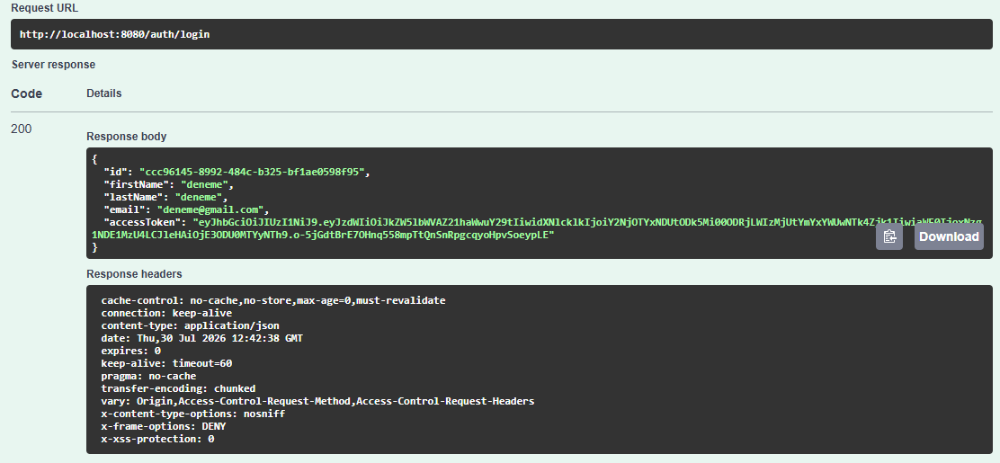

**Email Çakışması (409 Conflict):**

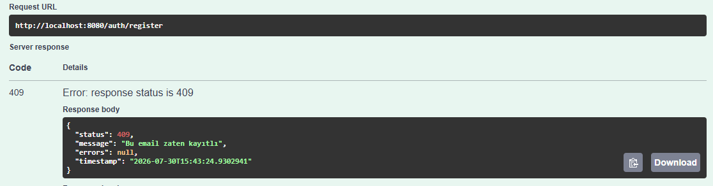

**Rate Limit Aşımı (429 Too Many Requests):**

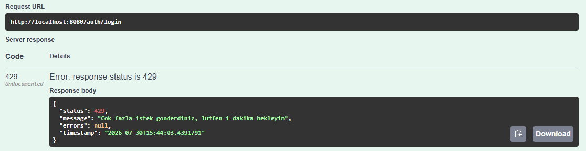

### Hata Yanıtları

| HTTP Kodu | Durum | Açıklama |
|---|---|---|
| `400` | Bad Request | Validasyon hatası (eksik/hatalı alan) |
| `401` | Unauthorized | Email/şifre hatalı veya token geçersiz |
| `409` | Conflict | Email zaten kayıtlı |
| `429` | Too Many Requests | Rate limit aşıldı (1 dakikada 5 istek) |
| `500` | Internal Server Error | Beklenmeyen sunucu hatası |

Hata yanıt formatı:
```json
{
  "status": 401,
  "message": "Email veya şifre hatalı",
  "errors": null,
  "timestamp": "2025-07-15T14:30:00"
}
```

## Güvenlik Detayları

- **Şifre Hashleme:** Argon2 algoritması (saltLength=16, hashLength=32, parallelism=1, memory=16384, iterations=2)
- **Access Token:** JWT, 15 dakika ömürlü, `Authorization: Bearer <token>` header'ında taşınır
- **Refresh Token:** JWT, 7 gün ömürlü, HttpOnly + Secure cookie'de saklanır
- **Token Rotation:** Her refresh işleminde eski token geçersiz olur, yeni token çifti üretilir
- **Rate Limiting:** IP bazlı, 1 dakikada maksimum 5 istek (login ve register endpoint'lerine uygulanır)
- **Redis ile Token Yönetimi:** Refresh token'lar Redis'te `refresh:<userId>` key'i ile 7 gün TTL ile saklanır
- **CORS:** `localhost:5173`, `localhost:5174`, `localhost:8080` origin'lerine izin verilir
- **Session:** Stateless (JWT tabanlı, sunucu tarafında session tutulmaz)

### Veritabanı Görünümü

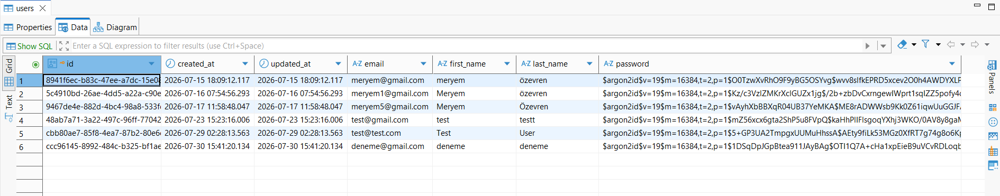

> Şifreler Argon2 algoritmasıyla hashlenmiş olarak saklanır. Düz metin şifre veritabanında hiçbir zaman tutulmaz.

### Redis Token Görünümü

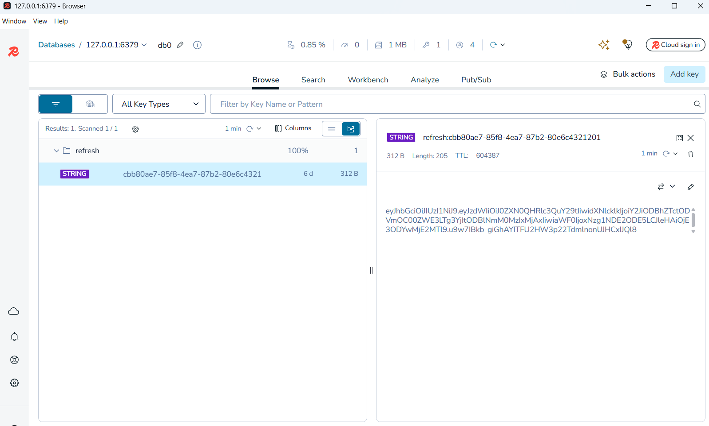

> Refresh token'lar Redis'te `refresh:<userId>` key'i altında 7 gün TTL ile saklanır.

## Portlar

| Servis | Port | Açıklama |
|---|---|---|
| **Spring Boot API** | `8080` | Ana uygulama |
| **PostgreSQL** | `5432` | Veritabanı |
| **Redis** | `6379` | Token & rate limit deposu |
| **Prometheus** | `9090` | Metrik toplama |
| **Grafana** | `3000` | Metrik görselleştirme (admin/admin123) |

## Monitoring

Prometheus metrikleri Grafana üzerinden görselleştirilmektedir. Dashboard'a `http://localhost:3000` adresinden erişilebilir (varsayılan kullanıcı: `admin`, şifre: `admin123`).

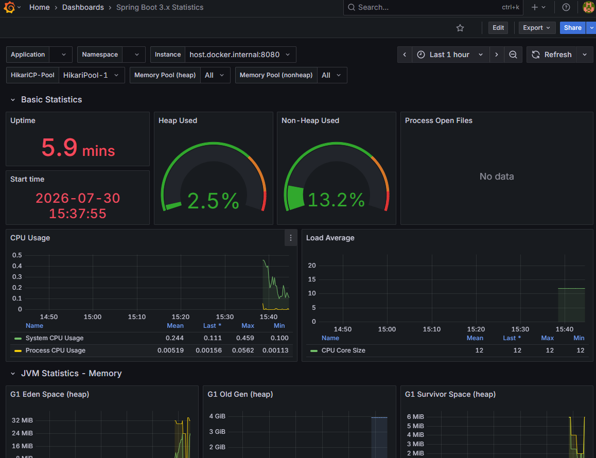

## Kurulum ve Çalıştırma

### 1. Ön Gereksinimler

- Java 21
- Maven
- Docker & Docker Compose

### 2. `.env` Dosyasını Oluşturma

> **Bu dosya güvenlik nedeniyle repoya dahil edilmemiştir** (`.gitignore`'da tanımlıdır). Projeyi klonladıktan sonra `backend/` dizininde kendiniz oluşturmanız gerekir.

`backend/.env` dosyasını aşağıdaki şablona göre oluşturun ve kendi değerlerinizle doldurun:

```env
# ---------- PostgreSQL ----------
DB_HOST=localhost
DB_PORT=5432
DB_NAME=vbt_login_db
DB_USERNAME=postgres
DB_PASSWORD=kendi_sifreniz

# ---------- JWT ----------
JWT_SECRET=en_az_32_karakter_uzunlugunda_guclu_bir_anahtar_olusturun

# ---------- Server ----------
SERVER_PORT=8080

# ---------- Redis ----------
REDIS_HOST=localhost
REDIS_PORT=6379
REDIS_PASSWORD=
```

**Önemli notlar:**
- `JWT_SECRET` en az 32 karakter uzunluğunda, rastgele ve güçlü bir string olmalıdır. Örnek üretmek için: `openssl rand -base64 32`
- `DB_PASSWORD` değerini `docker-compose.yml`'deki `POSTGRES_PASSWORD` ile aynı tutun, yoksa bağlantı kurulamaz.
- Bu dosyayı **kesinlikle Git'e pushlamayın**. `.gitignore`'da zaten tanımlıdır, ancak yine de dikkatli olun.

### 3. Altyapı Servislerini Başlatma

```bash
cd backend
docker-compose up -d
```

Bu komut PostgreSQL, Redis, Prometheus ve Grafana'yı ayağa kaldırır.

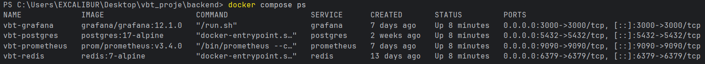

### 4. Uygulamayı Çalıştırma

```bash
./mvnw spring-boot:run
```

Veya `.env` dosyasındaki ortam değişkenleriyle:

```bash
./mvnw spring-boot:run -Dspring-boot.run.arguments="--server.port=8080"
```

### 5. API Dokümantasyonu

Uygulama başladıktan sonra Swagger UI'a erişin:

```
http://localhost:8080/swagger-ui.html
```

### 6. Testleri Çalıştırma

```bash
./mvnw test
```

### 7. Yük Testi

```bash
k6 run load-test.js
```

## Test Kapsamı

### Unit Testler
- **JwtServiceTest** (7 test): Token üretme, email/userId çıkarma, geçerlilik kontrolü, süresi dolmuş token, bozuk token
- **AuthServiceTest** (6 test): Başarılı kayıt/giriş/refresh/logout, email çakışması, geçersiz refresh token
- **RefreshTokenServiceTest** (5 test): Redis'e kaydetme, geçerli/geçersiz/olmayan token kontrolü, silme

### Integration Testler
- **AuthIntegrationTest** (10 test): Gerçek HTTP istekleriyle uçtan uca test (H2 + embedded Redis ile)
  - Register: başarılı kayıt (201), aynı email ile tekrar (409), eksik alan (400)
  - Login: doğru bilgi (200), yanlış şifre (401), olmayan email (401)
  - Refresh: geçerli cookie (200), cookie olmadan (401)
  - Logout: başarılı çıkış (200), logout sonrası refresh (401)

### Test Sonuçları

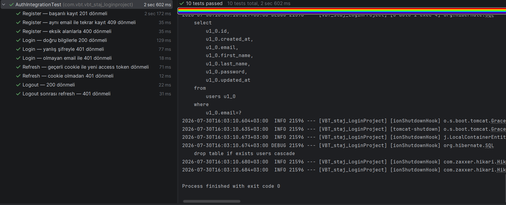

### Yük Testi Sonuçları (k6)

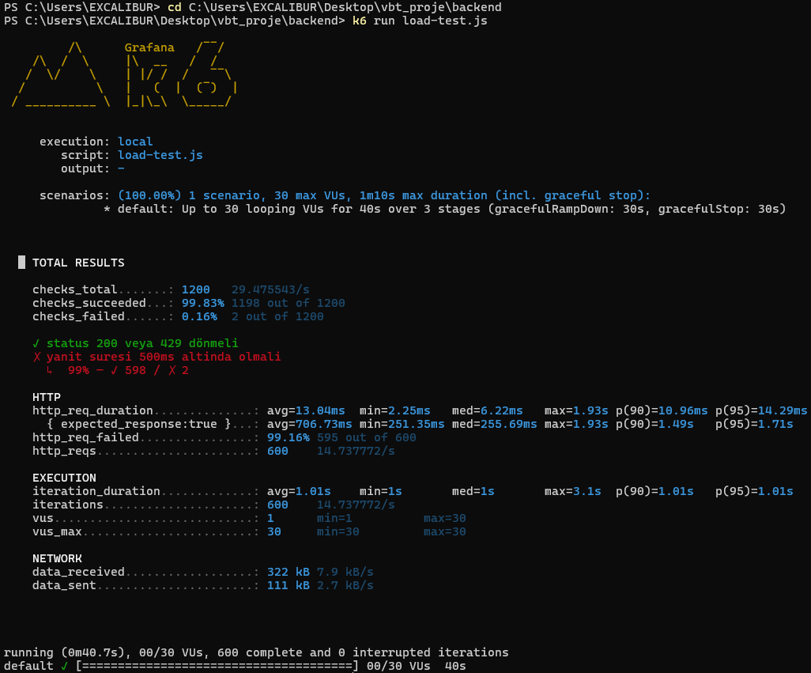

## Ortam Değişkenleri

| Değişken | Varsayılan Değer | Açıklama |
|---|---|---|
| `DB_HOST` | `localhost` | PostgreSQL sunucu adresi |
| `DB_PORT` | `5432` | PostgreSQL portu |
| `DB_NAME` | `vbt_login_db` | Veritabanı adı |
| `DB_USERNAME` | `postgres` | Veritabanı kullanıcı adı |
| `DB_PASSWORD` | `login1234` | Veritabanı şifresi |
| `REDIS_HOST` | `localhost` | Redis sunucu adresi |
| `REDIS_PORT` | `6379` | Redis portu |
| `REDIS_PASSWORD` | *(boş)* | Redis şifresi |
| `JWT_SECRET` | *(varsayılan key)* | JWT imzalama anahtarı |
| `SERVER_PORT` | `8080` | Uygulama portu |
